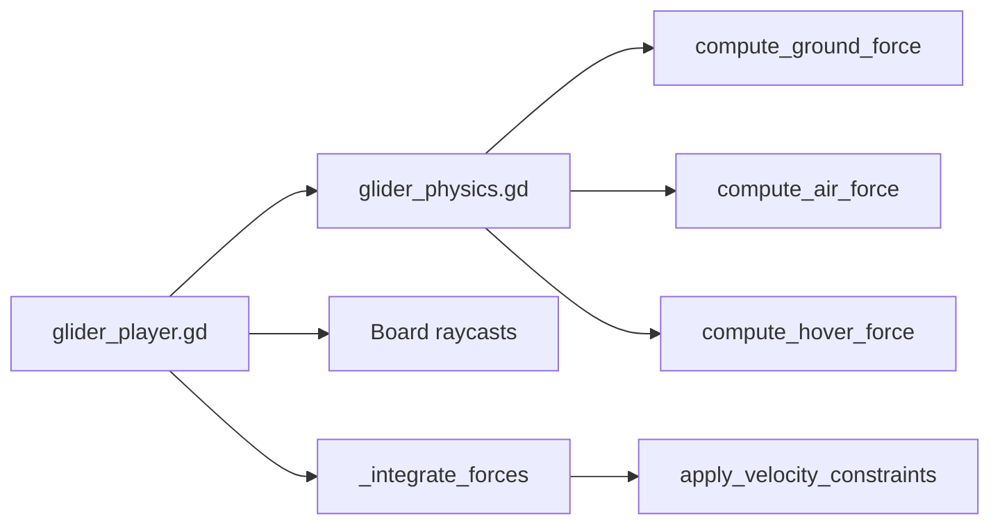

# Glider Game Feel

Tune `scripts/player/glider_physics.gd` (forces) and `scripts/player/glider_player.gd` (orchestration, orientation, input).

## Design pillars (do not break)

1. **Raycast surf, not collision surf** — root `collision_mask = 0`; ground via `_sample_board_contacts()` and `TerrainManager`.
2. **RigidBody force surf** — `gravity_scale = 0`; arcade forces via `compute_*_force` in `_integrate_forces`, then `apply_velocity_constraints` for caps — not engine gravity.
3. **Split simulation loop** — probes/state/alignment in `_physics_process`; forces in `_integrate_forces`.
4. **Physics body upright, tilt on Visual** — yaw on body (`axis_lock_angular_x/z`); pitch/roll via `_deck_world_basis` on `Visual`.
5. **Two modes, one vertical owner** — `GROUNDED` = hover repulsion + ground forces; `GLIDING` = air lift + gravity forces.

## Key files

| File | Role |
|------|------|
| `scripts/player/glider_physics.gd` | **Physics kernel** — `compute_*_force`, `apply_velocity_constraints`, touchdown |
| `scripts/player/glider_player.gd` | State machine, input, terrain sampling, orientation, `_integrate_forces` |
| `scripts/player/glider_camera.gd` | Follow blend, floor clearance, velocity yaw |
| `scripts/player/verify_glider.gd` | Headless physics regression tests |
| `scenes/player/glider.tscn` | RigidBody3D root (`mass`, axis locks), particles, touch/camera children |

## Tuning workflow

```
Feel tuning:
- [ ] 1. Reproduce complaint (state, terrain, input)
- [ ] 2. Map to kernel function (see constants-reference.md)
- [ ] 3. Change 2–3 related constants in glider_physics.gd
- [ ] 4. Run verify_glider (scripts/run-verify.ps1)
- [ ] 5. F5 manual: idle hover, downhill surf, crest launch/land, brake
```

**Step 1 — Diagnose**

| Symptom | Likely subsystem |
|---------|-------------------|
| Floaty / won't settle at 0.75 m | `HOVER_REPULSION_K`, `HOVER_WEIGHT_GRAVITY`, `HOVER_DAMPING` in `glider_physics.gd` |
| Clips into sand on slope | `HOVER_REPULSION_K`, `SURF_CONTACT_FORCE_K` in `glider_physics.gd` |
| Bouncy landing | `LAND_DAMP_DURATION`, `LAND_DAMP_SPRING_SCALE` |
| Weak downhill speed | `GROUND_SLOPE_GRAVITY`, `SLOPE_DRIVE_BLEND` |
| Launch doesn't feel airborne | `HOVER_ZONE`, `AIR_GRAVITY`, lift constants |
| Board tilt wrong / snaps | `DECK_ALIGN_STRENGTH`, `TERRAIN_BASIS_RATE`, `_align_air_attitude` in player |
| Camera jitters | `glider_camera.gd` |

**Step 4 — Verification (required after physics edits)**

```powershell
.cursor/skills/glider-game-feel/scripts/run-verify.ps1
```

## Architecture



| Mode | When | Forces applied |
|------|------|----------------|
| `GROUNDED` | clearance ≤ `HOVER_ZONE` | `compute_ground_force` + `compute_hover_force` (+ surf spring on steep downhill) → constraints |
| `GLIDING` | crest launch over `HOVER_ZONE` | `compute_air_force` (+ landing flare force) → constraints |

**RigidBody tuning knobs** (`glider.tscn`): `mass` (~90), `axis_lock_angular_x/z`, `can_sleep = false`.

**Removed subsystems** (do not re-add without reason): height assist, floor target Y, high-approach cushion, bounce guard, anti-stall, compress/rise velocity kills, `move_and_slide`, post-slide Y teleports.

## Anti-patterns

- Enabling terrain `collision_mask` to fix clipping (optional follow-up only)
- Re-enabling CharacterBody `floor_snap_length` or `move_and_slide`
- Putting force logic back in `glider_player.gd` instead of the kernel
- Hard-snapping Y every frame instead of repulsion forces

## Definition of done

1. All `verify_glider.gd` tests pass
2. Manual F5 checklist: idle hover, downhill surf, crest launch/land, brake stop

## Additional resources

- Symptom → constant map: [constants-reference.md](constants-reference.md)
